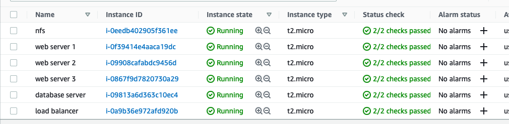
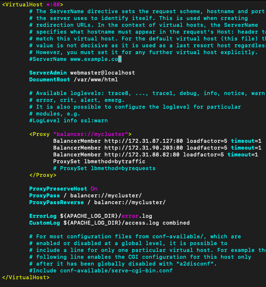

# Project 8 - Load Balancer Solution With Apache

**Step 1 - Spin Up Server For Load Balancer**
---

- Spin up a new Ubuntu server for the load balancer. Open TCP port 80 in the incoming rules config as the load balancer will be receiving traffic from the internet.

- Ensure that all machines are running and all services are running as well (apache2, httpd, nfs-server, mysql)


**Step 2 - Installing The Load Balancer**
---

- Run the commands below:
```
sudo apt update
sudo apt upgrade
sudo apt install apache2 -y
sudo apt-get install libxml2-dev

sudo a2enmod rewrite
sudo a2enmod proxy
sudo a2enmod proxy_balancer
sudo a2enmod proxy_http
sudo a2enmod headers
sudo a2enmod lbmethod_bytraffic

sudo systemctl restart apache2
sudo systemctl status apache2
```

**Step 3 - Configuring The Load Balancer**
---

- Run `sudo vi /etc/apache2/sites-available/000-default.conf` to configure the load balancer settings.

- Add the configuration line below into the <VirtualHost *:80> section.
```
<Proxy "balancer://mycluster">
               BalancerMember http://<WebServer1-Private-IP-Address>:80 loadfactor=5 timeout=1
               BalancerMember http://<WebServer2-Private-IP-Address>:80 loadfactor=5 timeout=1
               ProxySet lbmethod=bytraffic
               # ProxySet lbmethod=byrequests
        </Proxy>

        ProxyPreserveHost On
        ProxyPass / balancer://mycluster/
        ProxyPassReverse / balancer://mycluster/
```



- 