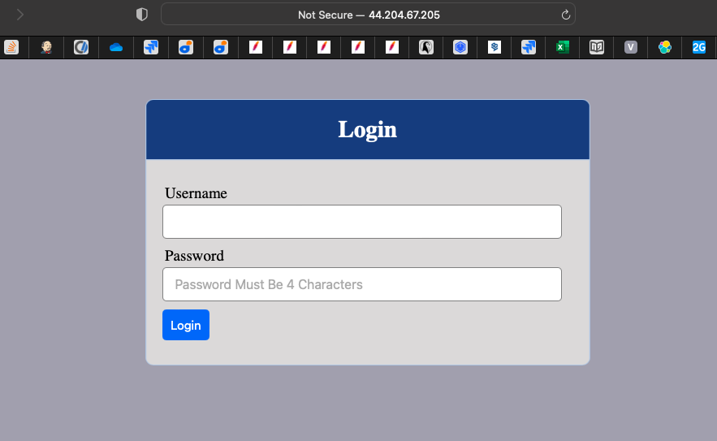

# Project 8 - Load Balancer Solution With Apache

**Step 1 - Spin Up Server For Load Balancer**
---

- Spin up a new Ubuntu server for the load balancer. Open TCP port 80 in the incoming rules config as the load balancer will be receiving traffic from the internet.

- Ensure that all machines are running and all services are running as well (apache2, httpd, nfs-server, mysql)


**Step 2 - Installing The Load Balancer**
---

- Run the commands below:
```
sudo apt update -y
sudo apt upgrade -y
sudo apt install apache2 -y
sudo apt-get install libxml2-dev

sudo a2enmod rewrite
sudo a2enmod proxy
sudo a2enmod proxy_balancer
sudo a2enmod proxy_http
sudo a2enmod headers
sudo a2enmod lbmethod_bytraffic

sudo systemctl restart apache2
sudo systemctl status apache2
```

**Step 3 - Configuring The Load Balancer**
---

- Run `sudo vi /etc/apache2/sites-available/000-default.conf` to configure the load balancer settings.

- Add the configuration line below into the <VirtualHost *:80> section.
```
<Proxy "balancer://mycluster">
               BalancerMember http://<Web1-Private-IP-Address>:80 loadfactor=5 timeout=1
               BalancerMember http://<Web2-Private-IP-Address>:80 loadfactor=5 timeout=1
               BalancerMember http://<Web3-Private-IP-Address>:80 loadfactor=5 timeout=1
               ProxySet lbmethod=bytraffic
               # ProxySet lbmethod=byrequests
        </Proxy>

        ProxyPreserveHost On
        ProxyPass / balancer://mycluster/
        ProxyPassReverse / balancer://mycluster/
```


*If you want to configure a public domain name using Apache, add the following under the VirtualHost section*
```
ServerName mydomain.com
ProxyPass / balancer://mycluster/
ProxyPassReverse / http://mydomain.com/
``` 
*Note that the above `mydomain.com` will be replaced by the domain you intend to use*

- Run `sudo systemctl restart apache2` to restart apache and save changes.

*Note that we used the `bytraffic` method to load balance. There are other methods like; `bybusyness`, `byrequests`, `heartbeat` etc*

- To verify our configuration works, check the load balancer's public IP in a browser. It should take youto the login page.
```
http://<Load-Balancer-Public-IP-Address-or-Public-DNS-Name>/index.php
```



- On the webservers, run `sudo tail -f /var/log/httpd/access_log` to open the log file that logs information from the webpage.

- Reload the open page in the browser several times and check the open config file in the webserver. You would notice that each new reload is logged across the webservers.


*I noticed the time was logging in GMT and not my local timezone*

**Step 4 - Configure Local DNS Name Resolution**
---

- Sometimes it is tedious to remember the IPs of different machines especially when the number of machines starts to increase. Here, we use local DNS resolution to we can "tie" the IP of the machine to an easier name.

    - Run `sudo vi /etc/hosts` to open the hosts file where hostnames are saved.

    - Add the records into this file with Local IP address and arbitrary name for the Web Servers.
    ```
    <WebServer1-Private-IP-Address> Web1
    <WebServer2-Private-IP-Address> Web2
    <WebServer2-Private-IP-Address> Web3
    ```

    

-  Run `sudo vi /etc/apache2/sites-available/000-default.conf` and add the newly created hostnames.


- Restart apache2.

- Curl any of the webserver hostnames from the LB to confirm if local DNS is working.


*Remember, this is only internal configuration and it is also local to your LB server, these names will neither be ‘resolvable’ from other servers internally nor from the Internet.*

**Apache Load Balancing Solution Deployed Successfully!**

